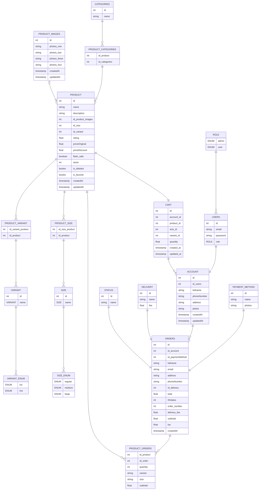

#  ☕ Coffee Shop Senja Kopi Kiri
> The Senja Kopi Kiri app allows users to order coffee products directly through the app, from adding products to their cart, making payments using available payment methods, to viewing their order history and details. Users can also update information on their profile page for a more personalized and flexible experience. Furthermore, the app supports a forgot password feature, where users can request a password reset and receive a token via their registered email. The system has two roles: user and admin, with the admin responsible for managing the categories and products available in the app.

 
## 📸 Preview
### Swagger Documentation

### Table ERD Coffe-shop Senja Kopi Kiri


🚀 Features
- 🔐 JWT Authentication (Login & Register)
- 🔑 Forgot Password via Email Token
- 🛒 Order Management (Add to Cart, Checkout, Payment)
- 🧾 View Order History & Order Details
- 👤 User Profile Management (Update Personal Information)
- 🛠️ Admin Management for Categories & Products
- ✨ Multiple File Upload (e.g., product images)
- 📘 Swagger Auto-Generated API Documentation
- 📦 PostgreSQL Integration via Prisma Client  
- 👤 Role-Based Authentication & Authorization (User & Admin)


## 🛠️ Tech Stack


##  🔐 .env Configuration
```
# Database
DATABASE_URL="postgresql://<user>:<password>@localhost:5432/<dbname>"

# JWT
JWT_SECRET=your_jwt_secret

# Redish
REDIS_URL=redis://default:<password>@localhost:6379

# SMTP
SMTP_HOST=smtp.gmail.com
SMTP_PORT=587
SMTP_USER=<your_email>
SMTP_PASS=<your_app_password_email>
SMTP_FROM=<aplication-name> <your_email> # from
FRONTEND_URL=<your_frontend_url>

# CORS
CORS_ORIGIN_1=<url_frontend1>
CORS_ORIGIN_2=<url_frontent2>
```

## 📦 How to Install & Run Project
### 1. First, clone this repository: 
```
https://github.com/federus1105/koda-b4-backend-node.git
```
### 2. Install Dependencies
```js
npm i
```
### 3. Setup your environment
### 4. Do the Prisma Migration
### 5. Run Server/Project
```js
npm run dev
```
### Open Swagger Documentation in Browser
#### ⚠️ Make sure the server is running
```http://localhost:8011/api-docs```


<br>


## 🗃️ How to run Prisma Migrations
### ⚠️ Attention: This only applies to PostgreSQL, because enums can only be used in PostgreSQL.
### 1. Install Prisma Client
```bash
npm i @prisma/client
```
### 2. Create database
```bash
CREATE DATABASE <database_name>;
```
### 3. Prisma Migrate
```bash
npx prisma migrate dev --name <name_migrations>
```
### 4. Prisma Generate
```bash
npx prism generate
```


## 👨‍💻 Made with by
📫 [federusrudi@gmail.com](mailto:federusrudi@gmail.com)  
💼 [LinkedIn](https://www.linkedin.com/in/federus-rudi/)  

## 📜 License
Released under the **MIT License**.  
You’re free to use, modify, and distribute this project — just don’t forget to give a little credit

[](LICENSE)

